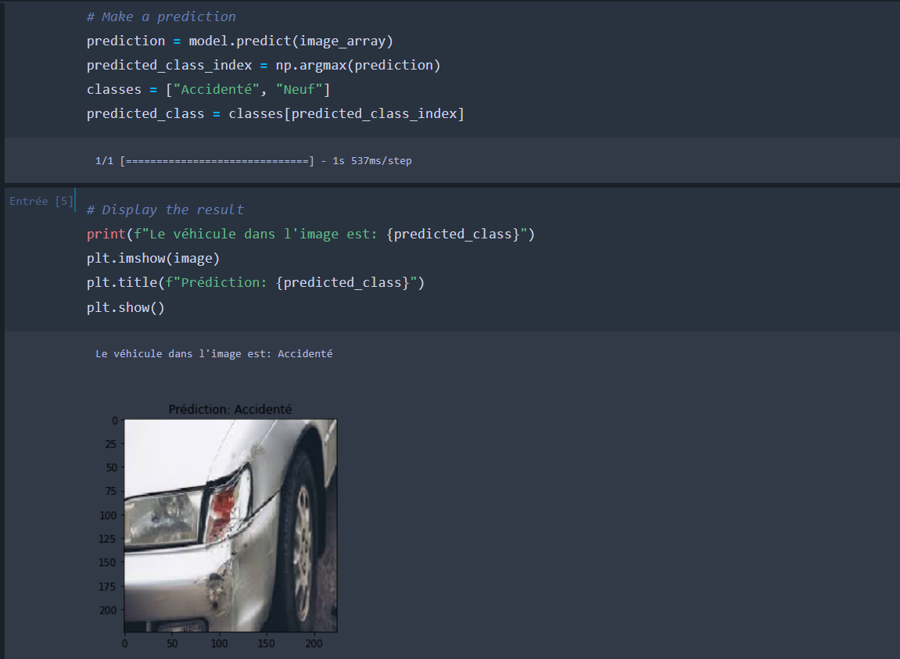
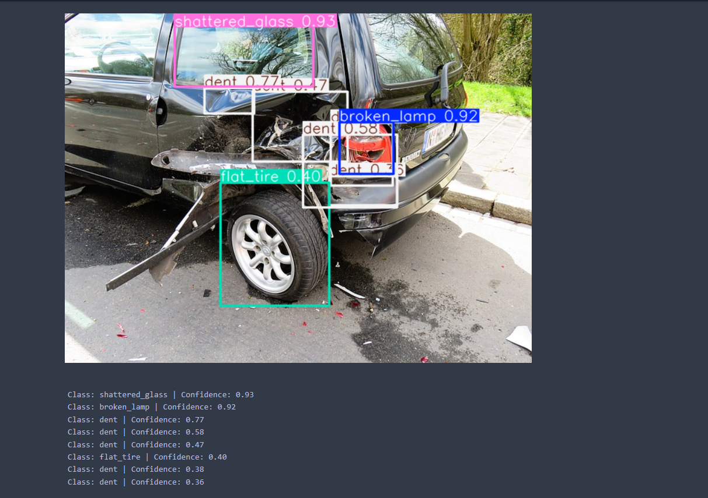
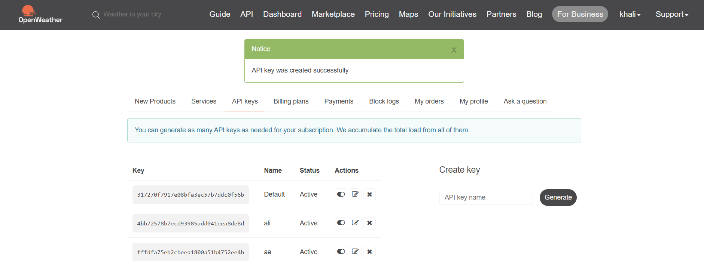

# 🚗 Insurance Fraud Detection System

## 📌 Project Overview
This project develops a comprehensive **insurance fraud detection system** for the automotive sector, integrating **machine learning**, **computer vision**, **web scraping**, and **weather APIs**. It includes: (1) a model to detect vehicle damage, (2) YOLOv5-based detection of damaged car parts, (3) web scraping for auto parts pricing, (4) weather data integration, and (5) fraud detection for clients and garages, enhanced by a Bonus-Malus system. The system aims to identify fraudulent claims and ensure fair pricing.

---

## 📂 Dataset
- **Vehicle Damage Detection**: Images in `DataDir/training/` and `DataDir/validation/` with subfolders `00-damage` and `01-whole`.
- **YOLOv5 Parts Detection**: Custom dataset for car parts (e.g., shattered glass, broken lamp) in `dataset.yaml`.
- **Web Scraping**: Auto parts data from `https://www.rockauto.com`.
- **Weather Data**: Current and forecast data for Tunisia via OpenWeatherMap API.
- **Fraud Detection**: Merged datasets (vehicles, policies, insured individuals, claims) for client and garage fraud analysis.

---

## 🔍 Project Workflow

### **1. Vehicle Damage Detection**
Classify vehicles as damaged or not using a MobileNetV2-based model.

```python
from tensorflow.keras.applications import MobileNetV2
from tensorflow.keras.models import Model
from tensorflow.keras.layers import MaxPooling2D, Flatten, Dense, Dropout
from tensorflow.keras.callbacks import LearningRateScheduler
from tensorflow.keras.optimizers import Adam

# Load MobileNetV2
model_base = MobileNetV2(weights="imagenet", include_top=False, input_shape=(224, 224, 3))
model_head = model_base.output
model_head = MaxPooling2D(pool_size=(5, 5))(model_head)
model_head = Flatten(name="flatten")(model_head)
model_head = Dense(128, activation="relu")(model_head)
model_head = Dropout(0.5)(model_head)
model_head = Dense(2, activation="softmax")(model_head)
model_final = Model(inputs=model_base.input, outputs=model_head)

# Freeze base layers
for layer in model_base.layers:
    layer.trainable = False

# Compile and train
model_final.compile(loss="binary_crossentropy", optimizer=Adam(learning_rate=0.001), metrics=["accuracy"])
model_final.fit(aug.flow(trainX, trainY, batch_size=32), epochs=10, validation_data=(testX, testY), callbacks=[LearningRateScheduler(lambda epoch, lr: lr * 0.95)])
```

### **2. Damaged Parts Detection with YOLOv5**
Detect specific damaged car parts using a custom-trained YOLOv5 model.

```python
import torch
from PIL import Image

# Train YOLOv5
!python train.py --img 416 --batch 16 --epochs 50 --data dataset.yaml --weights yolov5s.pt --cache --name 1st_train

# Test
model = torch.hub.load('ultralytics/yolov5', 'custom', path='1st_train/weights/best.pt')
image = Image.open('test5.jpg')
results = model(image)
detections = results.pandas().xyxy[0]
for _, row in detections.iterrows():
    print(f"Class: {row['name']} | Confidence: {row['confidence']:.2f}")
```

### **3. Web Scraping for Auto Parts Pricing**
Scrape pricing data from RockAuto to validate garage quotes.

```python
from selenium.webdriver.support.ui import WebDriverWait
from selenium.webdriver.support import expected_conditions as EC
from bs4 import BeautifulSoup

# Scrape RockAuto
driver.get('https://www.rockauto.com/fr/partsearch/?mfr=AIRTEX')
WebDriverWait(driver, 20).until(EC.presence_of_element_located((By.CLASS_NAME, "listing-text-row-moreinfo-truck")))
soup = BeautifulSoup(driver.page_source, 'html.parser')
part_listings = soup.find_all('td', class_='listing-border-top-line listing-inner-content')
data = []
for index, part in enumerate(part_listings):
    manufacturer = part.find('span', class_='listing-final-manufacturer').text.strip() if part.find('span', class_='listing-final-manufacturer') else 'Unknown'
    part_number = part.find('span', class_='listing-final-partnumber').text.strip() if part.find('span', class_='listing-final-partnumber') else 'Unknown'
    price = driver.find_element(By.ID, f"dprice[{3 + index}][v]").text.strip()
    data.append({'Manufacturer': manufacturer, 'Part Number': part_number, 'Price': price})
driver.quit()
```

### **4. Weather API Integration**
Retrieve weather data to contextualize claims (e.g., weather-related damage).

```python
from pyowm import OWM

owm = OWM('your-api-key')
def print_weather(data):
    ref_time = datetime.datetime.fromtimestamp(data.ref_time).strftime('%Y-%m-%d %H:%M')
    print(f"Time: {ref_time}\nOverview: {data.detailed_status}\nTemperature: {data.temperature('fahrenheit')}")
weather_api = owm.weather_at_place('Tunisia')
print_weather(weather_api.weather)
```

### **5. Fraud Detection**
- **Client Fraud**: Model trained on merged datasets (vehicles, policies, claims) using conditions defined in `Fraude detection/client`. Classifies clients as fraudulent or not.
- **Garage Fraud**: Validate garage pricing against scraped data.

```python
def check_garage_fraud(df, manufacturer, part_number, price_entered):
    record = df[(df["Manufacturer"].str.upper() == manufacturer.upper()) & (df["Part Number"].str.upper() == part_number.upper())]
    if not record.empty:
        price_base = float(record.iloc[0]["Price"].replace('$', ''))
        return "Fraudulent" if price_entered > price_base * 1.2 else "Honest"
    return "Part not found"
```

- **Bonus-Malus**: Detect fraud using inconsistencies in Bonus-Malus classes, responsibility percentages, and vehicle counts. Models tested: Decision Tree, Logistic Regression, Random Forest, Naive Bayes.

---

## 📊 Results
- **Vehicle Damage Detection**:
  ```
  precision    recall  f1-score   support
  00-damage    0.93      0.83      0.88       230
  01-whole     0.85      0.94      0.89       230
  accuracy                          0.89       460
  ```
  - Visualization:

    
- **YOLOv5 Parts Detection**: Detected parts (e.g., `shattered_glass: 1, dent: 5`) saved in `pieces_detachées.json`.
  - Visualization:

    
- **Web Scraping**: Auto parts pricing stored in JSON.
- **Weather API**: Weather data for Tunisia, visualized in

  .
- **Fraud Detection**: Best model (Random Forest) achieves high accuracy for client and garage fraud detection.

---

## 📦 Requirements
```bash
pip install tensorflow opencv-python torch yolov5 pandas numpy selenium beautifulsoup4 pyowm scikit-learn
```

---

## 📌 Key Insights
- **MobileNetV2** achieves 89% accuracy in detecting vehicle damage.
- **YOLOv5** accurately identifies specific damaged parts, enhancing claim validation.
- **Web scraping** ensures fair pricing by comparing garage quotes to market data.
- **Weather API** provides context for weather-related claims.
- **Fraud detection** combines rule-based (Bonus-Malus) and ML approaches for robust client and garage fraud identification.

---

## 📜 License
MIT License
